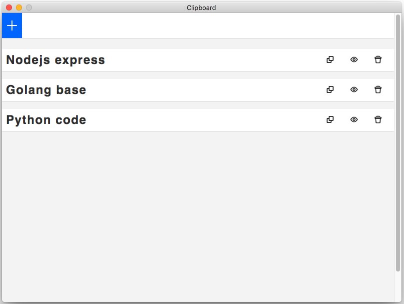

# Clipboard

:pencil: **clipboard app written with [electron](https://www.electronjs.org/).**

Facilitating application to search for pre-saved texts or codes for pasting directly from the clipboard.

<h3 align="center">
  <a href="#" target="_blank">
    
  </a>
  <a href="#" target="_blank">
    
  </a>
</h3>

## Running locally

Clone de repository, open its folder and install dependencies with:

```sh
yarn
```

Run it using:

```sh
yarn start
```

## Preview

Sample preview running the app:



## Author

👤 **Wellington Gadelha**

- Github: [@informeai](https://github.com/informeai)

## Show your support

Give a ⭐️ if this project helped you!
